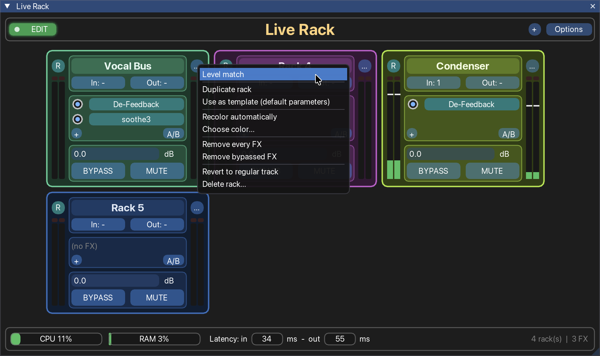

# Live Rack

A rack-based FX panel for [REAPER](https://www.reaper.fm), made for live sound.

Live Rack turns a handful of REAPER tracks into **racks**: strips with their own input and output
routing, a chain of FX, a level, mute and bypass, and input/output meters. All racks live in one
window, away from your playback tracks, so the mixer and the track view stay clean.

> **Status: work in progress (v0.x).** It is used and tested on macOS with REAPER 7.81. Windows and
> Linux are untested. Expect rough edges and changes between versions.


<!-- Add a screenshot of the window at docs/screenshot.png -->

**Contents:** [What it does](#what-it-does) · [Quick start](#quick-start) · [Requirements](#requirements) ·
[Installation on a fresh REAPER](#installation-on-a-fresh-reaper) · [Using Live Rack](#using-live-rack) ·
[Good to know](#good-to-know) · [Troubleshooting](#troubleshooting) ·
[Updating and uninstalling](#updating-and-uninstalling)

---

## What it does

- **Racks are tracks.** Any track whose name starts with `RACK:` becomes a rack. Live Rack hides it
  from the track list and the mixer, keeps it off the master, and shows it in its own window.
- **Everything about a rack in one strip:** name, input and output routing, FX chain, level (dB),
  BYPASS, MUTE, and input/output meters with peak hold and clip markers.
- **Edit and Show modes.** A cue-light switch (green = Edit, red = Show) locks the racks and their FX
  while you perform. Level, mute, bypass and FX on/off keep working.
- **Quick FX handling.** Add, insert, replace, delete, reorder, copy and move FX between racks with
  menus and drag and drop.
- **Level match.** Measures a rack's input and output (RMS) and sets its level so the output matches
  the input.
- **Duplicate a rack, or use it as a template** (same FX, default parameters).
- **Rack colors,** automatic or picked by hand, plus a **Daylight** theme for bright rooms.
- **Status bar** with CPU and RAM gauges, REAPER's latency, and rack and FX counts.

---

## Quick start

Starting from a fresh REAPER? Do [Installation](#installation-on-a-fresh-reaper) first (about ten minutes,
most of it ReaPack and ReaImGui). Once Live Rack is loaded as an action, this is the shortest way from an
empty window to a working rack:

1. **Run it.** In **Actions > Show action list...**, select **Script: LiveRack_v0.7.lua** and click **Run**.
   On a new project the window is empty.
2. **Create a rack.** Click the round **+** at the top right of the window (or double-click empty space).
   "Rack 1" appears. Behind the scenes it is a new track named `RACK: Rack 1`, hidden from REAPER's track
   list. *Already have a project?* Rename any track to `RACK: something` and it becomes a rack.
3. **Name it.** Double-click the rack's name and type.
4. **Route it.** Click **In:** to choose an input (mono, stereo or MIDI) and **Out:** to choose a hardware
   output.
5. **Add FX.** Click the round **+** in the rack's FX section and pick an FX from **Developers** or
   **All FX**. Click its button in the rack to open the plugin window.
6. **Play something through it.** The input meter is on the left, the output meter on the right. Set the
   level in the dB box, or use **... > Level match**.
7. **Add more racks.** Click **+** again, or use **... > Duplicate rack** to copy a rack with everything in it.
8. **Before the show:** click the green **EDIT** switch at the top left so it turns red (**SHOW**). The racks
   are now locked against accidents. Level, mute and bypass still work.

---

## Requirements

| What | Notes |
|---|---|
| [REAPER](https://www.reaper.fm) 7.x | Developed on 7.81. Older versions are not tested. |
| [ReaPack](https://reapack.com) | Used to install ReaImGui. |
| [ReaImGui](https://github.com/cfillion/reaimgui) | The graphics library Live Rack is built with. |

No other extensions are needed (SWS is not required).

---

## Installation on a fresh REAPER

### 1. Install REAPER

Download it from [reaper.fm](https://www.reaper.fm/download.php), install it, and start it once so it
creates its folders. It runs in evaluation mode until you buy a license.

### 2. Install ReaPack

ReaPack is an extension that installs scripts and extensions from inside REAPER.

1. Download the ReaPack file for your system from [reapack.com](https://reapack.com).
   Pick the one that matches your REAPER (for example Apple silicon vs. Intel on a Mac, 64-bit on
   Windows).
2. In REAPER, open **Options > Show REAPER resource path in explorer/finder**. Open the
   **UserPlugins** folder inside it.
   - macOS: `~/Library/Application Support/REAPER/UserPlugins`
   - Windows: `%APPDATA%\REAPER\UserPlugins`
   - Linux: `~/.config/REAPER/UserPlugins`
3. Copy the ReaPack file into **UserPlugins** and **restart REAPER**.
4. You should now have **Extensions > ReaPack**. On the first launch it may open a settings dialog;
   you can just close it.

> If macOS blocks the extension because it was downloaded from the internet, allow it in
> **System Settings > Privacy & Security**, then restart REAPER.

### 3. Install ReaImGui

ReaImGui comes from the default **ReaTeam Extensions** repository, which ReaPack already knows.

1. **Extensions > ReaPack > Browse packages...**
2. Type `imgui` in the filter box.
3. Right-click **ReaImGui: ReaScript binding for Dear ImGui** and choose **Install**.
4. Click **Apply** (bottom right), then **restart REAPER**.

### 4. Get Live Rack

1. Download `LiveRack_v0.7.lua` from this repository (it is a single file).
2. Copy it into REAPER's **Scripts** folder: **Options > Show REAPER resource path...** and open the
   **Scripts** folder.

### 5. Load it as an action

1. **Actions > Show action list...**
2. Click **New action... > Load ReaScript...**
3. Choose `LiveRack_v0.7.lua`.

### 6. Run it

In the action list, find **Script: LiveRack_v0.7.lua** and click **Run**. The Live Rack window opens.
It can float, or be docked (see [Docking](#docking)).

To make it easy to reach, right-click a toolbar and add the action, or assign it a shortcut.
To open it automatically when REAPER starts, set it as a startup action (for example with the SWS
extension's *Global startup action*).

### First run: what happens

- Live Rack writes its small meter plugin (a JSFX) to
  `<REAPER resource path>/Effects/LiveRack/LiveRack_Meter`. You do not need to install it yourself.
- If the window shows no racks, click the round **+** in the top bar (or double-click empty space) to
  create your first rack.
- Existing tracks are untouched. A track only becomes a rack when its name starts with `RACK:`.

---

## Using Live Rack

### A rack at a glance

```
 (R)  [      Rack name      ]  (...)      R   = routing window
  |   [ In: 1   |  Out: 1/2 ]   |        ... = Rack Option Menu
  |   ------------------------   |
  |   (o) FX one                 |        (o) = FX on/off, click a name to open the FX window
  |   (o) FX two                 |
  |   (+)               [A/B]    |        + = add an FX, A/B = invert every FX on/off
  |   ------------------------   |
  |   [ 0.0            ] dB      |
  |   [ BYPASS ]  [ MUTE ]       |
 input meter                output meter
```

- **Name:** click to select the rack, double-click to rename, drag to reorder.
- **In / Out:** pick the hardware input (mono, stereo or MIDI) and the hardware output.
- **R:** opens REAPER's own routing window for the rack, for sends and receives.
- **FX:** click a name to open or close the plugin window. The dot turns one FX on or off.
- **Level box:** type a value in dB (a comma works as the decimal mark, `-inf` is allowed).
  Shift + double-click resets it to 0 dB.
- **BYPASS** turns every FX off and restores them as they were when you click it again.
- **Meters:** input on the left, output on the right. White lines show the peak hold; the box on top
  lights red on a clip. Click any meter to reset all of them.

### Mouse and keyboard

| Action | Result |
|---|---|
| Click a rack's name | Select that rack |
| Cmd/Ctrl-click a rack's name | Add the rack to the selection, or remove it |
| Click empty space | Deselect the racks |
| Double-click empty space | Asks whether to create a new rack |
| Double-click a rack's name | Rename the rack |
| Drag a rack by its name | Reorder racks. Drop in the empty space to move it to the last position |
| Drag an FX inside a rack | Reorder the FX |
| Drag an FX onto another rack | Copy it there |
| Hold Cmd/Ctrl while dropping an FX | Copy |
| Hold Alt while dropping an FX on another rack | Move |
| Right-click an FX | Insert FX, Replace FX, Delete FX... |
| Shift + double-click the dB box | Reset the level to 0 dB |
| Click a meter | Reset every peak hold line and clip marker |

The copy and move keys can be changed in **Options > Settings...**

### Edit and Show modes

The switch at the top left of the main bar toggles the mode (it is remembered between sessions).

| | Edit (green) | Show (red) |
|---|---|---|
| Level, mute, bypass, FX on/off, A/B | yes | yes |
| Open plugin windows | yes | yes |
| Select racks | yes | yes |
| Create, rename, reorder, recolor racks | yes | locked |
| Routing (In / Out / R) | yes | locked |
| Add, insert, replace, delete, move, copy FX | yes | locked |
| Rack Option Menu | yes | locked |

### Selecting racks

Click a rack's name to select it, and Cmd-click (Ctrl-click on Windows) to add or remove racks from
the selection. Selection is REAPER's own track selection, so both stay in sync. Selected racks glow.
Click empty space to deselect.

### The Rack Option Menu (the `...` button)

| Item | What it does |
|---|---|
| Level match | Listens for 3 seconds and sets the level so output matches input. Play a typical signal. |
| Duplicate rack | Copies the rack with everything: FX, parameters, routing, level. |
| Use as template | Same rack and FX, but every FX is re-added with default parameters. |
| Recolor automatically | Picks a color that contrasts with the racks before and after. |
| Choose color... | Opens a color picker. |
| Remove every FX / Remove bypassed FX | Cleans out the chain. |
| Revert to regular track | Makes it a normal track again: name prefix removed, back in the track list and mixer. |
| Delete rack... | Deletes the track, after a confirmation. |

If you open the menu on a **selected** rack, the action applies to **all selected racks**, after a
confirmation. Everything is undoable with REAPER's undo.

### Adding and changing FX

- **+ button** (or right-click an FX > **Insert FX**): a menu of your installed FX. Every entry shows
  its type before the name (`VST3: ...`, `AU: ...`, `JS: ...`), so versions of the same plugin can be
  told apart. The menu is grouped by your FX browser folders, developers, and type.
- **Right-click an FX:** *Insert FX* (before this one), *Replace FX* and *Delete FX...* (both ask first).
- **Drag an FX** to reorder it. Drop it on another rack to copy it there. Hold **Ctrl/Cmd** to copy,
  **Alt** to move.
- **Options > FX types** limits the menus to the FX types you use, with a count for each type.

### Dragging racks

Drag a rack by its name. A see-through copy follows the cursor and the rack under it is outlined.
Drop it on another rack to place it there, or in the empty space around or below the racks to send it
to the last position. Racks follow your project's track order.

### Color and Daylight

- **Options > Recolor every rack** colors all racks, starting from a random color, each contrasting
  with the previous one.
- **Choose default color...** and **New racks use automatic / default color** decide the color of racks
  you create or copy.
- **Daylight mode** switches the whole panel to a light theme for bright rooms. Each rack's own color
  is kept as a pale tint with a solid name label.

### Docking

Use **Options > Dock** to put the window in one of REAPER's dockers, or back to floating. You can also
drag the window onto a docker. The window remembers its dock.

### Status bar

CPU and RAM gauges, **Latency: in [..] ms - out [..] ms** as reported by REAPER, and the rack and FX
counts. Hover a gauge for details.

### Settings

**Options > Settings...** opens a window with the values you can change: automatic color ranges, meter
range and fall speed, Level match time and gate, copy and move keys, corner rounding, and the
dimensions of the racks (grouped under *Layout*). Changes apply immediately and are saved. Ctrl+click
a slider to type a value. **Reset to defaults** restores everything.

---

## Good to know

- **Racks never go through the master.** Live Rack keeps the master send off on every rack.
- **Hidden tracks.** Racks are hidden from the track list and mixer on purpose. To bring one back, use
  **Revert to regular track**.
- **Meter plugins.** Each rack gets two small meter JSFX, one first and one last in its chain. They
  never show in Live Rack's FX list. If you open a rack's FX chain in REAPER you will see them.
- **Opening a project on another computer** without Live Rack: the meters show up as missing plugins.
  This does not affect the audio.
- **CPU and RAM** come from the operating system (REAPER does not expose its Performance Meter to
  scripts). On macOS and Linux they show REAPER's share of the machine. On Windows the gauges show
  `n/a`. REAPER does not report processing time to scripts, so the status bar shows latency instead.
- **Saved settings** live in REAPER's own settings file. Each rack's bypass state is saved in the
  project. On macOS and Linux a tiny file (`/tmp/LiveRack_stats.txt`) is used for the CPU and RAM
  numbers.

---

## Troubleshooting

| Problem | What to try |
|---|---|
| "ReaImGui is not installed" | Follow [step 3](#3-install-reaimgui), then restart REAPER. |
| Any other error after a ReaImGui update | Update the script too, or report it with the file, line number and message. |
| "Could not add the meter JSFX" | Restart REAPER, or refresh the FX list (**Options > Preferences > Plug-ins > VST**, then re-scan). |
| Meters do not move | Check that audio is flowing through the rack. The output meter shows the level after the fader. |
| Something odd with racks or sound | **Options > Disable metering and Level match.** This also removes the meter plugins from the racks, to rule them out. Turn it off to bring them back. |
| CPU / RAM show `n/a` | They need macOS or Linux. See *Good to know*. |
| The window opens tiny or in the wrong place | Resize or dock it again. REAPER remembers windows by name. |
| A rack disappeared | It is hidden on purpose, but still a track named `RACK: ...`. Check the track list with *show hidden tracks* or the Track Manager. |

If you hit an error, the ReaScript error dialog shows the file, the line number and the message.
Please include all three in a bug report.

---

## Updating and uninstalling

- **Update:** replace the script file with the new one and re-run it. If the file name changed (it
  includes the version), load the new file in the action list and remove the old action.
- **Uninstall:** use **Revert to regular track** on racks you want to keep as normal tracks, remove the
  script action, delete the script file, and optionally delete
  `<REAPER resource path>/Effects/LiveRack/`.

---

## Contributing

Issues and pull requests are welcome. When reporting a bug, please include your REAPER version,
operating system, ReaImGui version, and the exact error message.

By contributing you agree that your contribution is licensed under the same terms as the project
(see below).

## License

Live Rack is free software, licensed under the **GNU General Public License, version 3 or (at your
option) any later version** (GPL-3.0-or-later). See the [LICENSE](LICENSE) file.

You are free to use, study, share and modify it. If you distribute a modified version, or a larger
work that includes it, you must make the source available under the same license.
